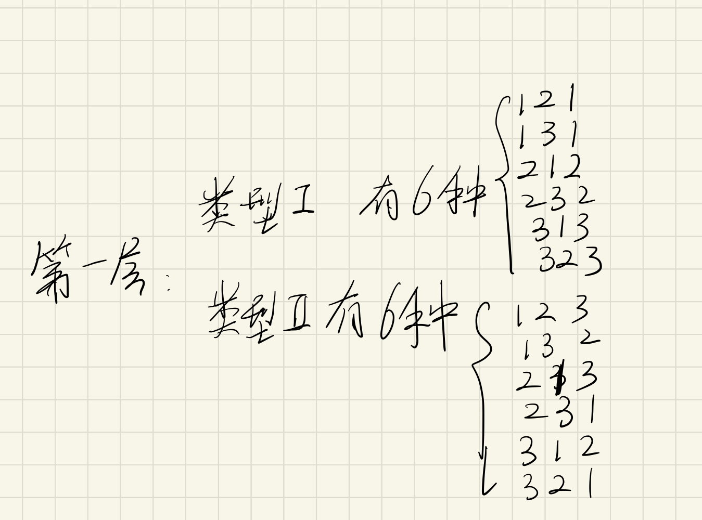
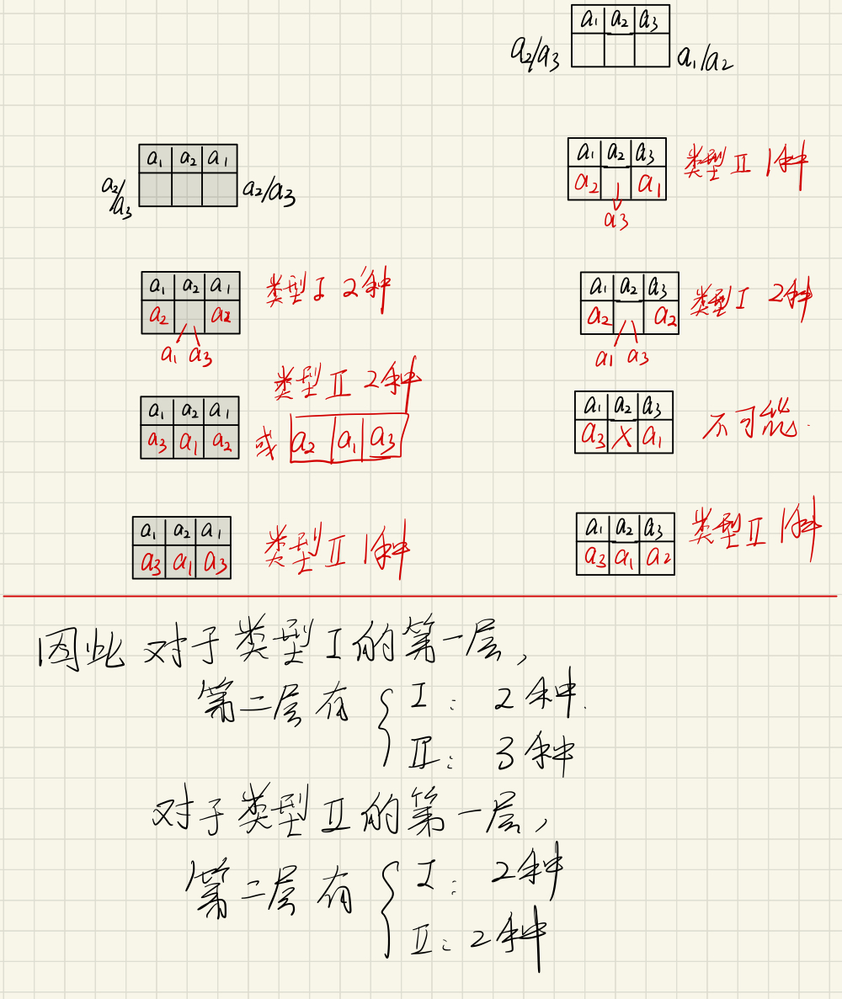
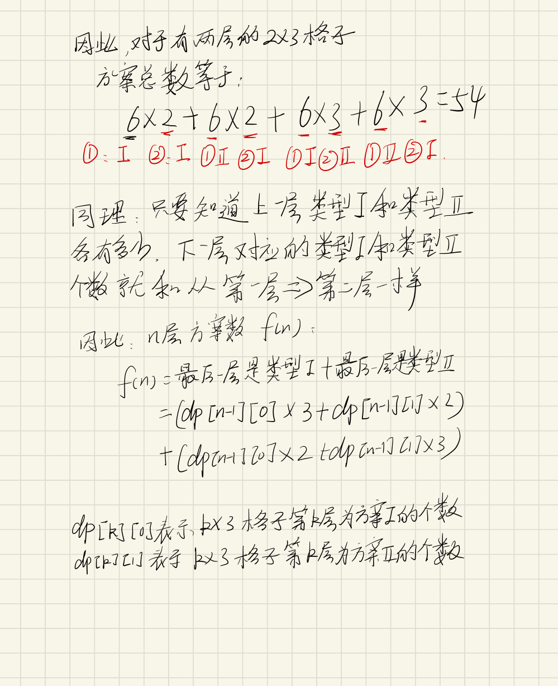

# LeetCode [1411. 给 N x 3 网格图涂色的方案数](https://leetcode-cn.com/problems/number-of-ways-to-paint-n-3-grid/)


## 暴力——复杂度太高了

可以用三重循环遍历得到所有可能的结果，但是可以想象复杂度之高，具体可以参看[LC官方解法一][https://leetcode-cn.com/problems/number-of-ways-to-paint-n-3-grid/solution/gei-n-x-3-wang-ge-tu-tu-se-de-fang-an-shu-by-leetc/]


## DP——递推

可以知道第$n$层的三个方格的数量只和第$n-1$层的方格有关，事实上归纳起来每一层无非就是两种类型：类型`I` $a_1a_2a_1$， 类型`II` $a_1a_2a_3$，其中$a_1, a_2, a_3$可以代表红黄蓝（我们用1，2，3表示）中任意一种。

比如第一层，特殊情况，没有限制，只需考虑所有可能。

类型`I`有`121`,`131`,`212`,`232`,`313`,`323`——6种

类型`II`有`123`, `132`, `213`, `231`, `312`,`321`——6种



如何利用第一层来推导第二层呢？





于是可以得到递推式：


$$
dp[n][0] = dp[n-1] * 3 + dp[n-1][1] * 2 \\ dp[n][1] = dp[n-1] * 2 + dp[n-1][1] * 2
$$
$$dp[n][0]$$表示$$n*3$$的格子第$n$层为类型`I`的方案总数

$$dp[n][1]$$表示$$n*3$$的格子第$n$层为类型`II`的方案总数

### 代码

```java
class Solution {
    public int numOfWays(int n) {
        long[][] dp = new long[n][2];
        dp[0][0] = 6;
        dp[0][1] = 6;
        int mod = 1000000007;
        for (int i = 1; i < n; i++) {
            dp[i][0] = (dp[i-1][0] * 3 + dp[i-1][1] * 2) % mod;
            dp[i][1] = (dp[i-1][0] * 2 + dp[i-1][1] * 2) % mod;
        }
        return (int)(dp[n-1][0] + dp[n-1][1]) % mod;
    }
}
```

可以压缩状态，我们发现其实它每次只用到上一层的方案数

```java
class Solution {
    public int numOfWays(int n) {
        long f1 = 6, f2 = 6;
        long newF1, newF2;
        int mod = 1000000007;
        for (int i = 1; i < n; i++) {
            newF1 = (f1 * 3 + f2 * 2) % mod;
            newF2 = (f1 * 2 + f2 * 2) % mod;
            f1 = newF1;
            f2 = newF2;
        }
        return (int)(f1 + f2) % mod;
    }
}
```

一个状态压缩立马将运行时间从8ms - > 3ms，从30%到 97%

时间复杂度$O(n)$

空间复杂度$O(1)$

注意，为了保证结果正确，或者说可以保存结果，每次做运算都要取余（常规思路——利用取余的性质）。