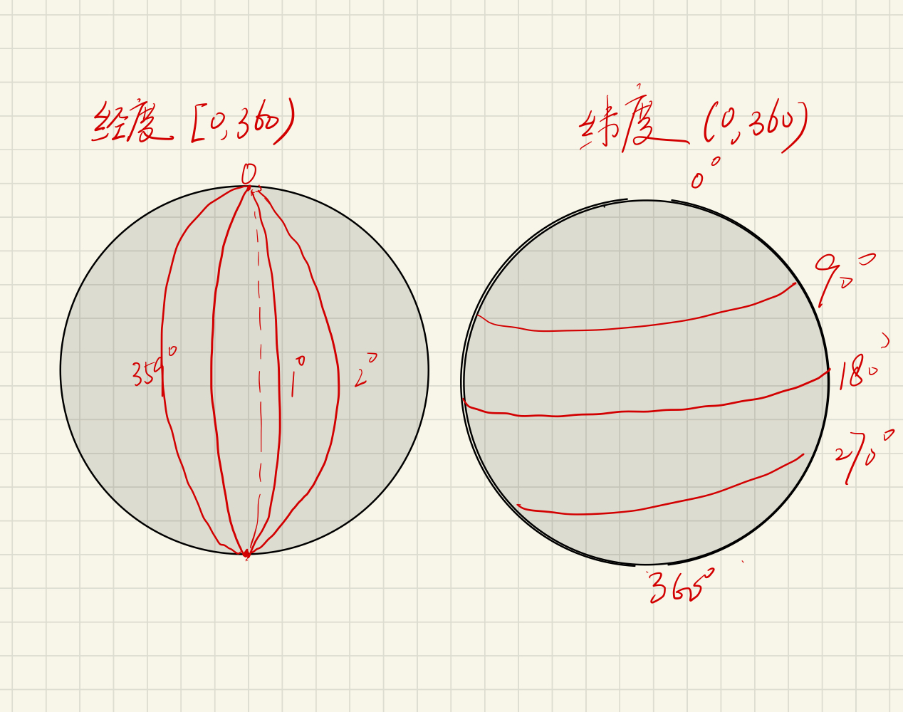

# 美团 2021年 4.04笔试 真题

## 第一题

> 一天，小美在写英语作业时，发现了一个十分优美的字符串：
> 这个字符串没有任何两个字符相同。
> 于是，小美随手写下了一个字符串，
> 她想知道这个字符串的的所有子序列，有多少个是优美的。
> 由于答案可能会很大，输出对20210101取模后的结果。
> 一个字符串的子序列定义为：
> 原字符串删除0个或多个字符后剩下的字符保持原有顺序拼接组成的字符串为原串的子序列。
> 如：ab是acba的子序列，但bc则不是。在本题中。空串也为原串的子序列。
>
> 两个子序列不相同，当且仅当他们对应原串的下标不相同。如aab则含有两个子序列ab。

首先，就是搜索所有可能的情况，统计（**穷举**）。假设字符串如 $a_1a_2……a_n$ ，它的一种优美字符串的可能不妨为 $a_{j_1}a_{j_2}……a{j_k}$，$a_{j_1}$即为原字符串第 $j_1$ 个位置的字符，那么这种是如何得到的呢？

**穷举思路**如下：

1. 优美字符串 $a_{j_1}a_{j_2}……a{j_k}$ 可以看成是一个长为n的串，其中 $j_1$, $j_2$，... $j_k$位置的字符都取了，而其他位置字符未取。还以上面`aabc`的两个优美字符串`abc`为例，用二进制串表示取和未取的情况即为`1011`和`0111`
2. 到这里，穷举很容易想到了，每个位置最多两种可能，取或者不取，因此总共需要搜索$2^n$种情况，对于长为n的串。穷举即可看成是在这颗满二叉树上进行遍历，可以适当剪枝，只要访问到某个位置，出现与之前的字符相同的，那么以该字符为根的子树不必再遍历。所以穷举利用DFS或者回溯即可。

**但是** 复杂度高达$O(2^n)$，即使做了剪枝，做的时候确实发现超时了，大概只能跑**36%**的case。  


后来看牛客网上的大佬分享的思路，恍然大悟，注意下面两个性质：

1. 优美字符串长度最大就是26，即为26个字母都出现的`abcdefghijklmnopqrstuvwxyz`序列对应到原字符串的顺序
2. 注意优美字符串与顺序有关，也就是说字符串`aabc`有两个`abc`的优美字符串，这两个是不一样的，一个是取了第一个`a`，另一个是取了第二个`a`

所以，和上面穷举思路不同，不是将任意一个待搜索的子串看成长为n的串，而是将它看成是一个至多长为26位的串（优美字符串中每个字符至多出现1次）。还是以之前的`aabc`为例，给定`abc`的优美子串有两个，因为`a`有两个可能的位置，第1位和第2位，`b`只有一种，`c`也只有一个。

那么如何计算所有的总数呢？聪明的小脑瓜已经想到了吧~

将26个字符所有的可能相乘即可，就这么简单！！！（这不就是高中常考的组合题嘛~换了一下套路，竟然没想到！）

具体来解释一下：

由于优美字符串的性质要求每个字符至多出现1次，因此对于给定字符串的优美字符串的总数就相当于一个计数任务——我们要从给定字符串中取出不重复的字符组成字符串，注意从不同位置拿到的字符组成的字符串是不同的（如那个`aabc`的例子）。  

我们这次不从穷举的那种从给定字符串的每个位置的角度（因为它是可变的），我们考虑所有的26个字符。从`a`开始，从给定字符串中取1个`a`或者不取，有多少种可能呢？等于`a`在字符串中出现的次数加1。

> 因为从不同位置取到的`a`是不同的，我们要把它放在对应的顺序上，可能不是很好理解。换个例子`abca`，拿`a`的时候，可以不拿，那么这个优美子串就没有`a`；可以拿第一个`a`，那么拿完就放在第一位，这个优美子串就是`a********`(26位），其他25个位置可以都空着，或者在这个例子里把`b`或`c`填上去；可以拿第二个`a`，那么拿完就放在第四位`***a******`，注意不同位置取出来的`a`得到的子串不同因为要保持每个字符在原字符中的相对顺序

取完`a`后，然后再看字符`b`，`b`的所有可能同样是有出现的次数加1，类似的这个计数过程有26步，无所谓先取谁，因为取出来之后一定要保证它们的相对顺序，但是不需要额外考虑这一点，因为只要看你是从哪个位置拿出来的，那么自然这个子串就是按照原字符串来构造。

说了这么多，还是拿`abca`这个例子来说明：

第一步 取`a`，三种：不取，取第一位的`a`，取第四位的`a`

第二步 取`b`，两种：不取，取第二位 `b`。到这里总共有六种情况："", "b", "a", "ab", "a", "ba"

第三步 取`c`，两种：不取，取第三位的`c`。到这里总共有12种情况，我就不一一列举了。发现了没，每一个步骤都是相互独立的，即使交换步骤顺序也可以。

第四步 取`d`，一种：不取，一直到取`z`，都只有一种。因此总共有12种完美子串。

### DFS+回溯 代码

采用一种不一样的思路——类似于双指针，第一个指针指向子串的起始，第二个指针遍历以第一个指针开始所有可能的子串。第一个指针 `i`遍历 $a_1$ ，... , $a_n$，第二个指针`j`（即代码中的`backtrack()函数中的`i`）遍历之后所有的元素，这样就可以覆盖所有可能的子串。利用HashSet保存当前的完美子串，如果第二个指针指向的字符与当前不重复则可以加进来构成新的完美子串，同时计数加一，如果重复，则跳过继续往后走。

注意因为要回溯，HashSet需要恢复到添加之前的情况，在代码中有两处：`set.clear()`和`set.remove(c)`

```java
import java.util.*;

public class Exam_1 {
    private static long res;
    public static void main(String[] args) {
        Scanner in = new Scanner(System.in);
        String s = in.nextLine();
        char[] array = s.toCharArray();
        int n = array.length;
        res = 1; // 空串也是完美子串
        HashSet<Character> set = new HashSet<Character>(); 
        for (int i = 0; i < n; i++) {
            set.add(array[i]);
            res++;
            backtrack(set, array, i+1);
            set.clear();
        }

        System.out.println(res % 20210101);
    }

    public static void backtrack(HashSet<Character> set, char[] array, int start) {
        int n = array.length;
        if (start >= n)
            return;
        for (int i = start; i < n; i++) {
            Character c = Character.valueOf(array[i]);
            if (set.contains(c))
                continue;
            res++;
            set.add(c);
            backtrack(set, array, i+1);
            set.remove(c);
        }
    }
}
```


### 最优解法 代码

```java
public class Main {
    public static void main(String[] args) {
        Scanner in = new Scanner(System.in);
        String s = in.nextLine();
        char[] array = s.toCharArray();
        
        System.out.println(solution(array));
    }
    public static long solution(char[] array) {
        int[] cnt = new int[26];
        Arrays.fill(cnt, 1); // 每个字符至少有一种情况：不取
        for (char c : array) {
            cnt[c-'a']++;
        }

        long res = 1;
        for (int i : cnt) {
            res *= i;
        }
        return res % 20210101;
    }
}
```


## 第二题

>今天是小美的生日，妈妈给她专门订制了一个球形的大蛋糕。
>小美决定对这个蛋糕切n刀。每次切小美会选择是横着切还是竖着切。
>将整个球划分经纬度。
>如果是横着切的话那么小美会选择一个纬度将整个球切成上下两部分；
>如果是竖着切的话那么小美会选择一个经度将整个球切成两半。
>小美想知道，切n刀之后整个球被划分成了多少个部分？
>请注意本题中经纬度的表示如图：（和常识有点不同）



对于纬度切分很简单，横向切了k刀，则将整个球分成k+1份

经度切分，纵向切了一刀，球变成两部分，再纵向切一刀，因为经线是会交叉的所以如果切了两刀（不重合的两刀）则变成四部分，所以切了k刀（有效的刀，必须排除在0度和180度，切了两次只相当于1次），则将整个求分成2*k份。

最后球会被分成 横向的份数 * 纵向的份数 （因为相互不相关的）

注意经度可能一刀都没切

```java
public class Main {

    public static void main(String[] args) {
        Scanner in = new Scanner(System.in);
        int n = in.nextInt();
        int t, x;

        int h; // 横向切的刀数，沿着纬线切
        int v; // 纵向切的有效刀数，沿着经线切
        Set<Integer> vSet = new HashSet<>();
        for (int i = 0; i < n; i++) {
            t = in.nextInt();
            x = in.nextInt();
            if (t == 1) { // 沿着经线切 
                int counterpart = x < 180 ? x : x - 180; // 将[0,  360)全部映射到[0, 180]，因为切得时候，0和180切出来的圈重合，1和181， 2和182，..., 179和359重合
                if (!vSet.contains(counterpart)) {
                    v++;
                    vSet.add(counterpart);
                }
            } else {
                h++;
            }
        }
        if (v == 0)
            v = 1;
        System.out.println(2 * v * (h + 1));
    }
}
```


## 第三题

> 小美发明了一个函数：f(x)，表示将x的所有正整数因子提取出来之后从小到大排列，
> 再将数字拼接之后得到的数字串。例如：10的所有因子为1,2,5,10，
> 那么将这些因子从小到大排序之后再拼接得到的数字串为12510，即f(10)=12510。
>
> 小美十分讨厌数字k，如果f(x)中含有某个子串对应的数字等于k，
> 那么她的不高兴度就会增加1。例如：f(8)=1248，那么其所有的子串为：1,2,4,8,12,24,48,124,248,1248，
> 只要k等于其中任意一个值，那么小美的不高兴度就会增加1。
> 对于每一个数，其不高兴度至多增加1。
> 现在，有一个长度为n的正整数序列，定义其不高兴度为序列中所有数的不高兴度的总和。
> 小美想要知道自己对于这个序列的总不高兴度为多少。

第三题直接暴力获取`x`所有的正整数因子，当然也可以只需循环到 $\sqrt x$ 即可找出所有的因子，然后拼成字符串。

对每个字符串判断是否其中有一个子串等于k，可以利用双重循环解法，或者KMP

```java
public class Exam_3 {
    public static void main(String[] args) {
        Scanner in = new Scanner(System.in);
        int n = in.nextInt(), k = in.nextInt();
        
        int res = 0, num;
        String kStr = String.valueOf(k);
        for (int i = 0; i < n; i++) {
            nums = in.nextInt();
          	String s = sub2(nums);
            if (s.contains(kStr)) // 利用String 自带的判断子串方法
                res++;
        }
        
        
        for (int i = 0; i < n; i++) {
            
        }
        System.out.println(res);
    }

    public static String sub1(int num) {
        StringBuilder sb = new StringBuilder();
        for (int i = 1; i <= num; i++) {
            if (num % i == 0)
                sb.append(i);
        }
        return sb.toString();
    }
  
    public static String sub2(int num) {
        StringBuilder sb = new StringBuilder();
        int sqrtOfNum = (int) Math.sqrt(num) + 1;
        LinkedList<Integer> restFactors = new LinkedList<>();
        for (int i = 1; i <= sqrtOfNum; i++) {
            if (num % i == 0) {
                restFactors.addFirst(num / i); // 为了保持有序
                sb.append(i);
            }
        }
        for (int i = 0; i < restFactors.size(); i++) {
            sb.append(restFactors.get(i));
        }
        return sb.toString();
    }
}
```

时间复杂度 $O(n*N*K)$，$n$ 为所有的数字总数，$N$为任意一个数字最长的因子数字串的长度，一个数字 $a$ 的因子数最多不会超过`1...a`这么多，即$a$个，因此 $N <= max$，$max$为最大的整数， $K$为数字$k$的数字位数。


## 第四题

> 小美在路上看到一些小学生在玩跳方格，她也想跟着一起玩。
> 这个方格被划分为n×n的小方格，即有n行n列。
> 每一个小方格上面都是一个1~k的正整数。小美想依次从1,2,…,k这个顺序来跳。
> 一开始小美可以站在任意一个小方格。
> 从一个方格跳到另一个方格的花费为两个方格的曼哈顿距离。
> 小美想知道是否可以依照该顺序一直跳到k，如果可以，最小的总花费是多少。
>
> 两个格子(x1,y1),(x2,y2)的曼哈顿距离为：|x1-x2|+|y1-y2|。
> 例如(3,4),(1,6)的曼哈顿距离为|3-1|+|4-6|=4。
>
> 如 
>
> 1)  下面这个格子，n = 3，k = 2，可以做到，最小花费是1 ([0,0] -> [0,1])
> 		1 2 1
> 		1 1 1
> 		1 1 1
> 2)  n = 4, k = 4，不可以，没有3，返回 - 1
> 		1 2 4 1
> 		1 4 4 2
> 		1 2 1 4
>		4 4 4 4

